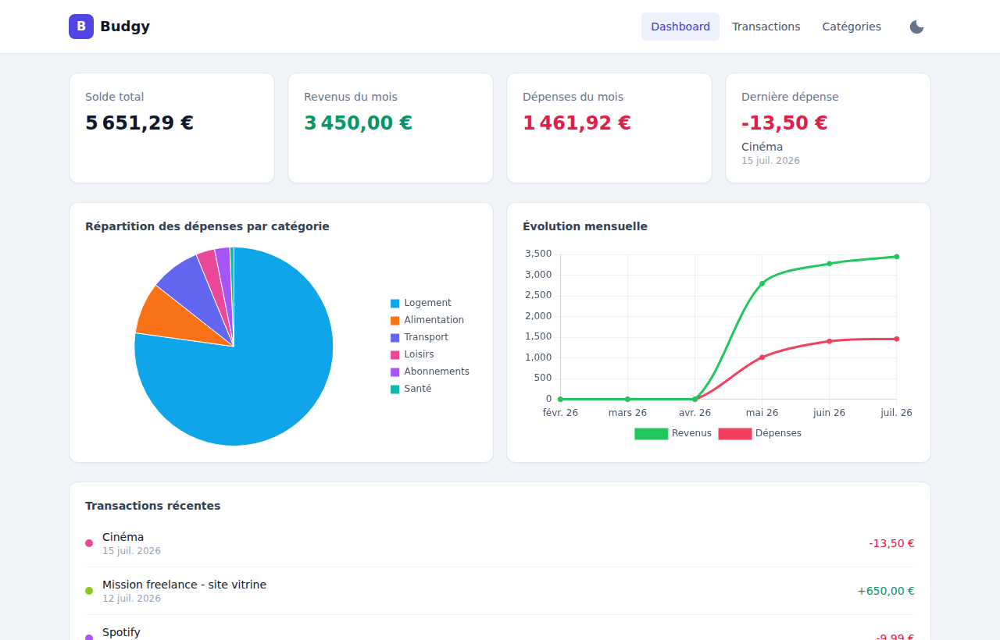
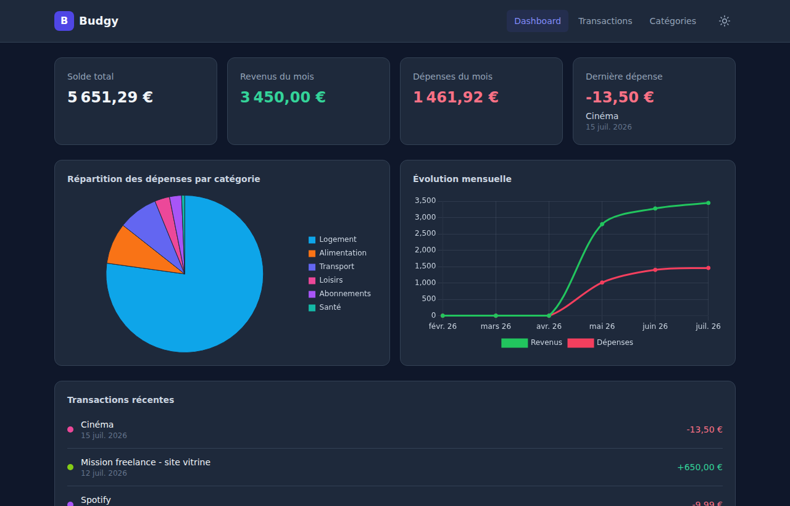
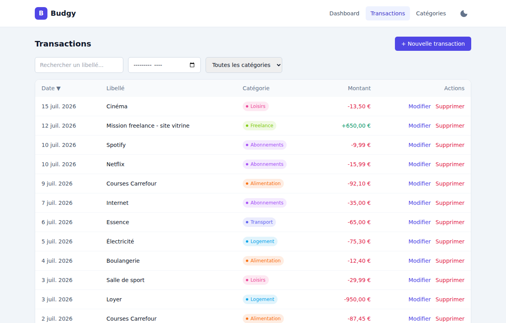
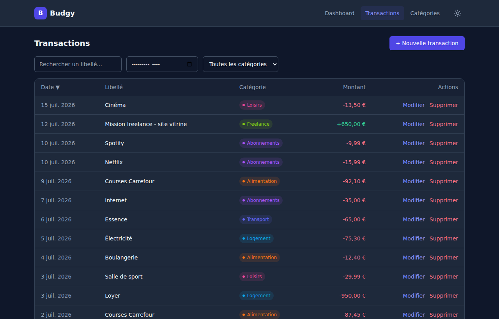

<div align="center">

# 💸 Budgy

**Gestionnaire de dépenses personnelles — full-stack, dockerisé, prêt en une commande.**

Dashboard avec statistiques, suivi des transactions et des catégories, graphiques, dark mode.

[](https://symfony.com)
[](https://php.net)
[](https://react.dev)
[](https://www.typescriptlang.org)
[](https://www.postgresql.org)
[](https://www.docker.com)

</div>

---

## Aperçu

<table>
<tr>
<td width="50%"></td>
<td width="50%"></td>
</tr>
<tr>
<td width="50%"></td>
<td width="50%"></td>
</tr>
</table>

## ✨ Fonctionnalités

- 📊 **Dashboard** : solde, revenus/dépenses du mois, dernière dépense, répartition par catégorie (camembert), évolution sur 6 mois, transactions récentes
- 💰 **Transactions** : création, édition, suppression, recherche par libellé, tri par date/libellé/montant, filtres par mois et catégorie
- 🏷️ **Catégories** : gestion complète avec couleur personnalisée
- 🌗 **Dark mode** : bascule clair/sombre, respecte la préférence système, persistée entre les sessions
- 🐳 **100% dockerisé** : un `docker compose up` et tout tourne — aucune installation locale de PHP, Node ou PostgreSQL requise

## 🧱 Stack technique

| Composant | Techno |
|---|---|
| Backend | Symfony 7 (PHP 8.3), API REST en JSON |
| ORM | Doctrine ORM + Migrations |
| Frontend | React 18 + TypeScript, Vite, Tailwind CSS |
| Graphiques | Chart.js (react-chartjs-2) |
| Base de données | PostgreSQL 16 |
| Orchestration | Docker Compose (4 services : `database`, `backend`, `nginx`, `frontend`) |

## 🚀 Démarrage rapide

**Prérequis** : Docker et Docker Compose (v2, plugin `docker compose`) — rien d'autre. PHP, Node et PostgreSQL tournent uniquement dans les conteneurs.

```bash
# 1. Copier le fichier d'environnement (valeurs par défaut déjà prêtes à l'emploi)
cp .env.example .env

# 2. Démarrer tous les services
docker compose up --build
```

Dans un **second terminal** (le premier reste occupé par les logs), initialiser la base de données :

```bash
# Crée les tables (category / transaction)
docker compose exec backend php bin/console doctrine:migrations:migrate --no-interaction

# Charge 8 catégories + ~30 transactions de démonstration
docker compose exec backend php bin/console doctrine:fixtures:load --no-interaction
```

C'est prêt 🎉

| Service | URL |
|---|---|
| Frontend | http://localhost:5173 |
| API backend | http://localhost:8080/api |

> Les ports se changent via `FRONTEND_PORT` / `NGINX_PORT` / `POSTGRES_PORT` dans `.env`.

## 📁 Structure du projet

```
Budgy/
├── docker-compose.yml
├── .env                    # variables d'environnement (généré depuis .env.example)
├── backend/                 # API Symfony
│   └── src/
│       ├── Entity/          # Category, Transaction
│       ├── Controller/      # CategoryController, TransactionController, StatsController
│       ├── Repository/      # requêtes Doctrine (dont les agrégations de /api/stats)
│       └── DataFixtures/    # jeu de données de démo
└── frontend/                # App React
    └── src/
        ├── pages/            # Dashboard, Transactions, Categories
        └── components/       # cartes, graphiques, modales
```

## 🛠️ Commandes utiles

```bash
# Arrêter les services (les données PostgreSQL sont conservées dans le volume db_data)
docker compose down

# Arrêter et supprimer aussi les volumes (⚠️ perte des données)
docker compose down -v

# Suivre les logs d'un service en particulier
docker compose logs -f backend

# Ouvrir un shell dans le conteneur backend
docker compose exec backend sh

# Régénérer une migration après modification des entités
docker compose exec backend php bin/console doctrine:migrations:diff

# Recharger les fixtures (vide et repeuple les tables)
docker compose exec backend php bin/console doctrine:fixtures:load --no-interaction

# Installer un nouveau paquet frontend / backend
docker compose exec frontend npm install <paquet>
docker compose exec backend composer require <paquet>
```

## 📡 API

Toutes les routes sont préfixées par `/api` et échangent du JSON.

### Catégories

| Méthode | Route | Description |
|---|---|---|
| GET | `/api/categories` | Liste des catégories |
| GET | `/api/categories/{id}` | Détail d'une catégorie |
| POST | `/api/categories` | Création (`{ name, color }`) |
| PUT/PATCH | `/api/categories/{id}` | Modification |
| DELETE | `/api/categories/{id}` | Suppression (refusée si des transactions y sont liées) |

### Transactions

| Méthode | Route | Description |
|---|---|---|
| GET | `/api/transactions?month=AAAA-MM&category=ID&search=texte&sort=date\|label\|amount&order=asc\|desc` | Liste, filtrable et triable |
| GET | `/api/transactions/{id}` | Détail |
| POST | `/api/transactions` | Création (`{ label, amount, type, date, categoryId }`) |
| PUT/PATCH | `/api/transactions/{id}` | Modification |
| DELETE | `/api/transactions/{id}` | Suppression |

`type` vaut `income` ou `expense`. `date` est au format `AAAA-MM-JJ`.

### Statistiques

| Méthode | Route | Description |
|---|---|---|
| GET | `/api/stats` | Totaux revenus/dépenses/solde, totaux du mois en cours, dernière dépense, répartition par catégorie, évolution sur 6 mois, 5 dernières transactions |

## ⚙️ Notes de configuration

- **CORS** : géré par `NelmioCorsBundle` (`backend/config/packages/nelmio_cors.yaml`), autorisé via la variable d'environnement `CORS_ALLOW_ORIGIN` (regex) injectée par `docker-compose.yml`, pour que le frontend (autre origine/port) puisse appeler l'API depuis le navigateur.
- **Hot-reload** : le code source de `backend/` et `frontend/` est monté en bind mount dans les conteneurs ; `vendor/`, `var/` et `node_modules/` restent dans des volumes dédiés pour ne pas être écrasés par le mount.
- **Persistance BDD** : les données PostgreSQL sont stockées dans le volume nommé `db_data`, qui survit aux `docker compose down` (mais pas à `docker compose down -v`).
- **Dark mode** : préférence stockée en `localStorage`, appliquée avant le premier rendu React pour éviter tout flash visuel.

## 🗺️ Pistes d'amélioration

- Budgets par catégorie avec seuils et alertes
- Export CSV des transactions
- Transactions récurrentes (loyer, salaire, abonnements)
- Authentification multi-utilisateur
- Tests automatisés (PHPUnit, Vitest)

---

<div align="center">
Fait avec Symfony + React
</div>
